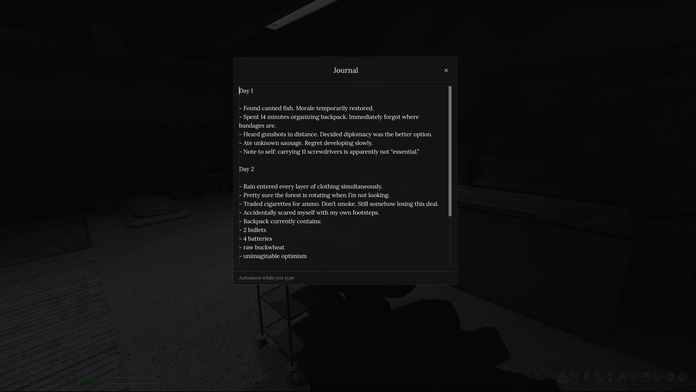

# Journal (Road to Vostok mod)

Pretty much a **notepad inside the game**. You open it, type stuff, and it **saves on its own** while you write. Looks dark and simple like the rest of the UI.

<p align="center">
  
</p>

## What you can do

- Press a key to **open / close** it (see below). Default is **J**.
- **Drag** the window by the **“Journal”** title.
- **Resize** it from the sides and bottom corners.
- Your text is saved to a file on your PC so it’s still there next time you play.

When it’s open you **can’t move or look around** so you don’t mess up by accident. There’s also a setting for whether the **whole game freezes** or keeps running in the background (you still can’t control your guy until you close it).

## Settings (MCM)

If you use **Mod Configuration Menu**, open **Journal** there.

| Setting | What it means |
|--------|----------------|
| **Toggle journal** | Which key opens and closes the journal. Default **J**. |
| **Pause entire game** | **On** = everything stops while the journal is open. **Off** = the game world can keep going, but you still aren’t walking around until you close the journal. |

No MCM? It still works, but you’re stuck with **J** to open/close and you can’t change the pause option from a menu.

## Building the mod zip

From this folder:

```powershell
.\package.ps1
```

Writes **`dist/journal.vmz`** with **`/`** entry names for Metro.

## Version

**v1.0.0** (see `mod.txt`).
